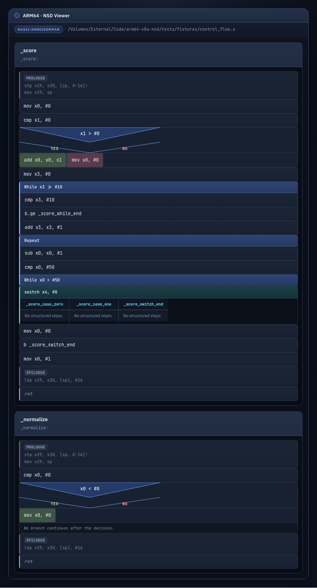
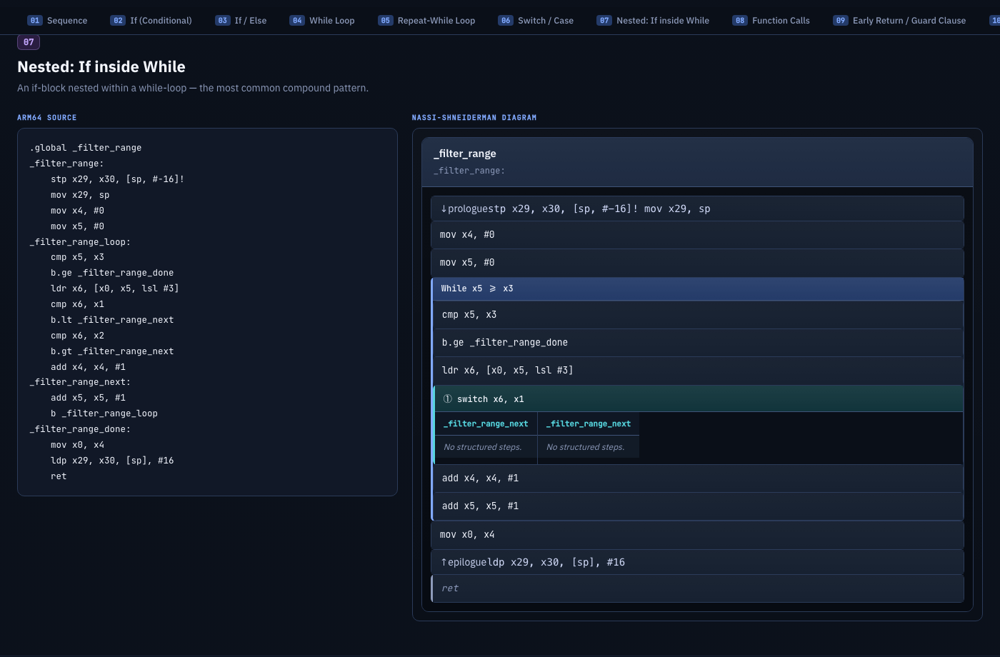
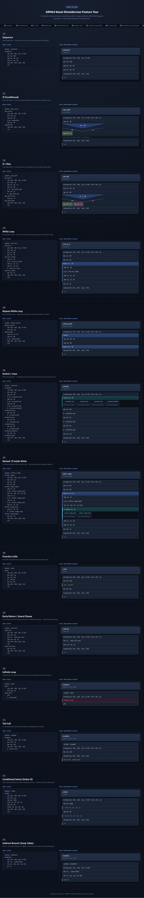
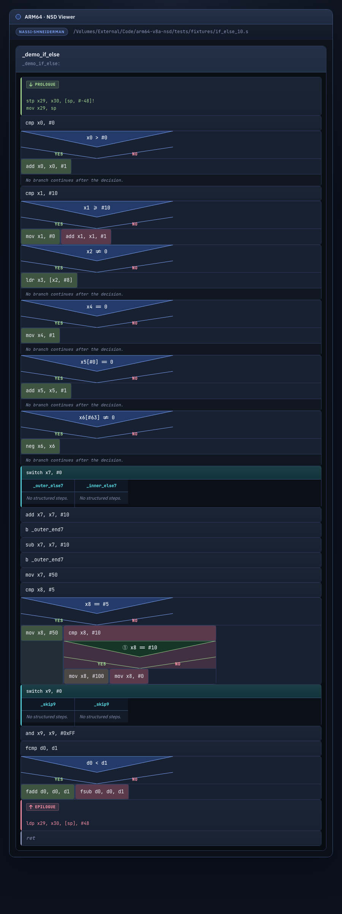

# arm64-v8a-nsd

ARM64/AArch64 assembly to Nassi-Shneiderman diagram converter. Parses GAS/Clang-syntax ARM64 assembly, extracts structured control flow, and renders interactive HTML diagrams with inline SVG. Zero runtime dependencies.

## What it does

* **ARM64 assembly parsing** — tokenizes GAS/Clang `.s` files, identifies labels, instructions, and comments
* **Control flow extraction** — reconstructs structured patterns from raw branch patterns:
  * if / if-else / guard
  * while loops (pre-condition)
  * repeat-while loops (post-condition)
  * infinite loops
  * switch / case (jump tables)
  * function calls (bl/blr), tail calls, early returns
  * break / continue inside loops
  * conditional select (csel/cset)
  * indirect branches (br xN)
* **Nassi-Shneiderman diagrams** — renders HTML with inline SVG:
  * classic NS triangles for if-blocks with Yes/No labels
  * horizontal dividers for case blocks with side-by-side columns
  * color-coded block types (loops=blue, calls=orange, returns=grey, etc.)
  * depth-coded nested ifs (up to 50 levels with color cycling and Unicode badges)
  * dark Tokyo Night-inspired theme with JetBrains Mono font
  * responsive layout

* **Feature tour** — self-contained HTML showcase with 13 embedded ARM64 examples covering every supported pattern

## Screenshots

**Control flow diagram** — if/else, while loop, repeat-while, switch/case in the `_score` function:



**Nested patterns** — nested if + while with depth-coded badges and color cycling:



**Feature tour** — interactive two-column layout with source code and NSD diagrams for all 13 patterns:



**10 if/else patterns** — comprehensive demonstration of conditional branching (cbz, cbnz, tbz, tbnz, nested conditions, fcmp):



## Architecture

DDD-inspired hexagonal architecture with four explicit layers:

* `domain` — control flow model, step types, ports
* `application` — use cases and DTOs
* `infrastructure` — ARM64 tokenizer, branch analyzer, control flow extractor, HTML renderer, tour generator
* `presentation` — CLI contract

## Quick Start

1. Install dependencies:

```bash
uv sync --extra dev
```

2. Generate a Nassi-Shneiderman diagram for an ARM64 assembly file:

```bash
uv run arm64nsd nassi-file path/to/code.s --out output/diagram.html
```

3. Generate diagrams for all `.s` files in a directory:

```bash
uv run arm64nsd nassi-dir path/to/project --out output/bundle
```

4. Generate the feature tour with all 13 ARM64 control flow patterns:

```bash
uv run arm64nsd tour --out tour.html
```

## Supported ARM64 Branch Patterns

| Pattern | Detection |
|---------|-----------|
| `b.cond target` (forward) | if / if-else |
| `cbz/cbnz target` (forward) | if (register == 0 / != 0) |
| `tbz/tbnz target` (forward) | if (register[bit] == 0 / != 0) |
| `b target` (backward) + forward conditional exit | while loop |
| `b.cond target` (backward) | repeat-while loop |
| `b target` (backward, no exit) | infinite loop |
| Multiple `b.eq/b.ne/b.lt...` to case labels | switch/case |
| `bl/blr target` | function call |
| `b external_label` (not in label map) | tail call |
| `ret` inside function body | early return |
| `b loop_header` inside loop body | continue |
| `b loop_exit` inside loop body | break |
| `csel/cset/csinc/csinv/csneg` | conditional select (inline if) |
| `br xN` | indirect branch |

## Constraints

The branch analyzer reconstructs structured control flow from unstructured assembly. It handles the common ARM64 patterns listed above but does not guarantee full coverage of arbitrary branch graphs (e.g., irreducible control flow, computed jump tables with data-driven indexing).
